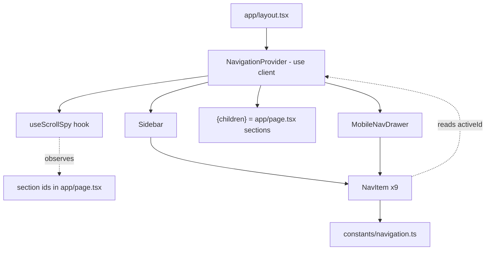
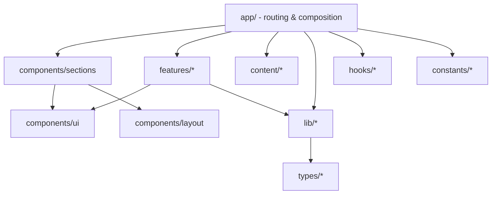
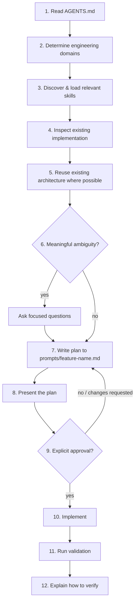
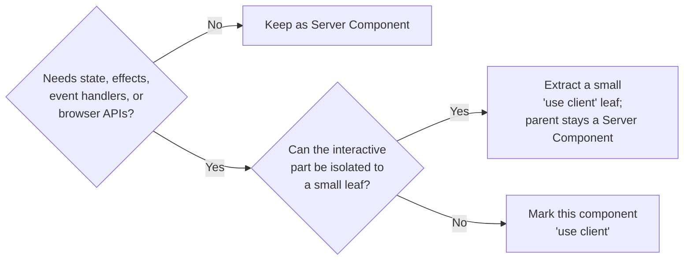

# AGENTS.md

You are a Senior AI Software Engineer working on this repository.

Your responsibility is not only to write code, but to preserve the long-term quality, consistency, and maintainability of this codebase.

Every implementation should leave the repository in a better state than before.

This document defines how you must think, plan, and implement work inside this repository.

If your default behavior conflicts with this document, follow this document.

---

## 0. How to Use This Document

- **This file is always in context.** Claude Code (and equivalent tools) auto-load `AGENTS.md` at the start of every session. Treat it as already-read — never ask the user to paste it, and never proceed as if a rule here doesn't apply because "it wasn't mentioned."
- **Skills are not auto-loaded.** Detailed, domain-specific guidance lives in `.agents/skills/` (see §9) and is loaded on demand, only when relevant, per task. This keeps this document lean and keeps agent context free of irrelevant detail.
- **Precedence order.** When guidance conflicts, resolve it in this order:

| #   | Source                                            | Notes                                                                                                                                                         |
| --- | ------------------------------------------------- | ------------------------------------------------------------------------------------------------------------------------------------------------------------- |
| 1   | **User instructions (current request)**           | Explicit, in-conversation instructions always win — but if they conflict with a hard rule below in a way that looks unintentional, flag it before proceeding. |
| 2   | **AGENTS.md (this file)**                         | Vendor-neutral repository law.                                                                                                                                |
| 3   | **Relevant Skills** (`.agents/skills/*/SKILL.md`) | Domain-specific detail that expands on, but never contradicts, this file.                                                                                     |
| 4   | **CLAUDE.md**                                     | Claude-specific process/behavior layer on top of AGENTS.md.                                                                                                   |
| 5   | **Existing project conventions**                  | What the surrounding code already does, when nothing above addresses the case.                                                                                |
| 6   | **Framework/tool defaults**                       | Next.js, React, ESLint, etc. defaults — the fallback when nothing else applies.                                                                               |

A lower source may add detail; it may never override a higher one. If a skill or convention contradicts this file, this file wins and the conflict should be reported, not silently resolved.

---

## 1. Project Overview

This repository is a personal software/AI engineering portfolio. It is simultaneously:

1. **A product** — a fast, accessible, well-designed site that gets a recruiter or founder to a hiring decision.
2. **A proof point** — the codebase itself is evidence of engineering ability. Sloppy code undermines the pitch more than a missing feature does.

Every change should be judged against both criteria.

## 2. Goals

- Showcase software engineering and AI engineering skill through working, well-architected code.
- Demonstrate backend engineering ability (APIs, data modeling, integrations) — not just frontend polish.
- Demonstrate deliberate architecture decisions, not framework defaults left untouched.
- Convert visits from recruiters and startup founders into conversations.
- Support long-term growth: a blog, case studies, and interactive demos, without a rewrite.

Non-goals: chasing every new library, building a CMS, or optimizing for content the site doesn't have yet.

## 3. Tech Stack

| Layer             | Choice                                 | Notes                                                    |
| ----------------- | -------------------------------------- | -------------------------------------------------------- |
| Framework         | Next.js 16 (App Router)                | Server Components by default                             |
| UI library        | React 19                               |                                                          |
| Language          | TypeScript, `strict: true`             | No new JS files                                          |
| Styling           | Tailwind CSS v4                        | Config lives in CSS (`@theme`), not `tailwind.config.js` |
| Linting           | ESLint (`eslint-config-next`)          | Must pass with zero warnings before merge                |
| Package manager   | npm (`package-lock.json` is committed) | Do not introduce a second lockfile                       |
| Deployment target | Vercel-style Node/edge runtime         | Avoid Node-only APIs in code that might run on the edge  |

Do not add a UI framework, state library, ORM, or CSS-in-JS solution without an explicit justification recorded in the PR description (see §31, Definition of Done).

## 4. Information Architecture & Navigation

The site is a single-page, section-based experience: one route (`/`) composed of stacked `<section>`s, not a multi-page site. The site's global navigation is fixed product structure, not a per-page decision. Any change to it (adding/removing/reordering an item) is a change to this document, not just to a component.

### 4.1 Primary navigation (in-page section anchors)

A persistent left sidebar is the primary navigation surface on desktop, scrolling the page to the matching section rather than navigating to a separate route. It is rendered once, in the root layout, and remains visible and unchanged as the user scrolls.

| #   | Label          | Section id       |
| --- | -------------- | ---------------- |
| 1   | Overview       | `overview`       |
| 2   | About          | `about`          |
| 3   | Experience     | `experience`     |
| 4   | Projects       | `projects`       |
| 5   | Case Studies   | `case-studies`   |
| 6   | Tech Stack     | `tech-stack`     |
| 7   | Certifications | `certifications` |
| 8   | Blog           | `blog`           |
| 9   | Contact        | `contact`        |

This order is fixed and matches the vertical order sections are stacked in `app/page.tsx`. Do not resequence, merge, or drop an item without updating this table (and the section order in `app/page.tsx`) first. Resume is not a section — see §4.2.

Projects, Case Studies, and Blog show **featured content only** ("Featured Projects," "Featured Case Studies," "Latest Blog"), each with a "View All" action deferred until its full listing route exists — see §4.6.

### 4.2 External links

Below the primary navigation, a secondary group of external links, in order:

- Resume
- GitHub
- LinkedIn
- Email

Resume opens/downloads the resume (currently `/resume`, a standalone route kept outside the section flow — swap for a direct file link once a real PDF exists) rather than scrolling to a section. GitHub and LinkedIn open in a new tab with `target="_blank" rel="noopener noreferrer"`. Email uses a `mailto:` link, not a contact-form redirect, so it works with no JavaScript.

### 4.3 Active state

- The active item is derived from which section is currently in view, computed by a single `IntersectionObserver`-based scroll-spy hook (`hooks/useScrollSpy.ts`) exposed through `NavigationContext` (`components/layout/NavigationProvider.tsx`) — never from the URL, since every section shares one route.
- Exactly one nav item is active at a time; the hook resolves simultaneous-intersection ties deterministically (see the hook's own implementation comment).
- Mark the active link with `aria-current="page"` in addition to any visual highlight — visual-only state fails for screen reader users.
- Clicking a nav item scrolls smoothly to its section (a plain anchor plus `scroll-smooth motion-reduce:scroll-auto` on `<html>` — no scroll-specific JavaScript), and the same observer that tracks manual scrolling then updates the active state once the section is in view. Click-driven and scroll-driven navigation are the same underlying signal, so they cannot drift out of sync with each other.

### 4.4 Responsive behavior

- Below the desktop breakpoint (`lg:`, 1024px, matching this project's mobile-first Tailwind convention — see §18), the sidebar collapses into a mobile navigation drawer triggered by a menu button.
- The drawer closes on: nav item selection, outside click, and <kbd>Escape</kbd>. While open, it traps focus and returns focus to the trigger button on close.
- The same navigation data (`constants/navigation.ts`) and the same `NavigationContext` drive both the sidebar and the drawer — see §4.5. Never maintain two separate lists of nav items or two independent scroll observers.

### 4.5 Architecture mapping

| File                                       | Responsibility                                                                                                                                                                    |
| ------------------------------------------- | ----------------------------------------------------------------------------------------------------------------------------------------------------------------------------------- |
| `constants/navigation.ts`                  | Single source of truth for nav order, labels, section ids, and external links (§4.1–§4.2).                                                                                       |
| `hooks/useScrollSpy.ts`                    | Pure client hook: one `IntersectionObserver` watching a list of ids, returns the currently active one. Knows nothing about navigation, labels, or context.                       |
| `components/layout/NavigationProvider.tsx` | `"use client"`, presentation-agnostic. Takes `sectionIds` as a prop — never imports `constants/navigation.ts` itself — calls `useScrollSpy` once, exposes `activeId` via context. |
| `components/layout/Sidebar.tsx`            | Desktop persistent sidebar. Renders `NavItem` per entry; unaware of `NavigationContext` itself.                                                                                   |
| `components/layout/MobileNavDrawer.tsx`    | Mobile drawer. `"use client"` — owns open/close state, focus trap, and escape handling; likewise unaware of `NavigationContext`.                                                  |
| `components/layout/NavItem.tsx`            | Shared link primitive (anchor to `#id`) used by both `Sidebar` and `MobileNavDrawer`; reads `activeId` directly via `useNavigationContext()` (§8.1, §27).                         |
| `components/layout/Section.tsx`            | Shared section wrapper: id, `aria-labelledby`, heading, consistent spacing — every `components/sections/*` component is built on this.                                           |
| `components/sections/*.tsx`                | One component per nav section (Hero, About, Experience, Projects, CaseStudies, TechStack, Certifications, Blog, Contact), each independent and self-contained.                   |
| `app/page.tsx`                             | Composes all nine section components in nav order — the entire homepage.                                                                                                          |
| `app/layout.tsx`                           | Renders `NavigationProvider` (wrapping `Sidebar` + `MobileNavDrawer` + `{children}`) once; sets `scroll-smooth motion-reduce:scroll-auto` on `<html>`.                            |



### 4.6 Future detail routes

Nothing about the single-page homepage removes the ability to add `/projects`, `/projects/[slug]`, `/case-studies`, `/case-studies/[slug]`, `/blog`, `/blog/[slug]` later — these are ordinary routes, distinct from and fully compatible with the `/` homepage's section anchors. They are not built yet; the homepage's featured sections (§4.1) simply don't link to them until they exist.

## 5. Section Layout

- Every primary homepage section must be implemented using the shared `Section` component (`components/layout/Section.tsx`) — never a raw `<section>` authored by hand in an individual section component.
- Every section must occupy at least one viewport height. Concretely this is `min-h-dvh`, not `min-h-screen`: the loaded Taste skill mandates `dvh` over `vh`/`screen` for full-height blocks specifically to avoid the mobile-Safari layout jump caused by the address bar showing/hiding — same visual result, more robust. `min-h-screen` is not used anywhere in this codebase for this reason; if you see it, that's a bug, not a style choice.
- Each section is an independent layout block and must not visually overflow into the next: sections stack in normal document flow (no negative margins, no absolute/fixed positioning pulling a section's content outside its own box), so one section's content can never bleed into a neighbor's.
- Sections may grow taller than the viewport when their content requires it, but must never be shorter than it — `min-h-dvh` is a floor, not a fixed height, so long content simply expands the section rather than overflowing or getting clipped.
- Shared layout rules — the viewport-height floor, responsive padding, the gap between a section's heading and its body content, and (if ever needed) a width constraint — belong in `Section.tsx`, not in individual `components/sections/*` files. A section component supplies only `id`, `heading`, and content; it must not hardcode its own margin/padding/min-height. No width constraint is applied by default today (content intentionally spans the full padded width per an earlier, explicit decision to drop `max-w-3xl`) — if one is ever needed, it's added to `Section.tsx` so every section picks it up uniformly, not per-file.
- Consistent inter-section spacing comes from each section's own padding, not from external margins between sections — sections butt directly against each other, so there's never an unstyled gap between two adjacent sections.

## 6. Repository Structure

### Current (as of this scaffold)

```
app/
  layout.tsx
  page.tsx
  globals.css
public/
.agents/
  skills/          # see §9
next.config.ts
tsconfig.json
eslint.config.mjs
postcss.config.mjs
package.json
```

### Target structure (grow into this; do not scaffold it all at once)

```
app/
  (routes and route groups; layouts, pages, loading/error boundaries, route handlers)
components/
  ui/            # small, generic, presentational primitives (Button, Badge, Card)
  ui/icons/      # local brand/social SVG icon components, see §12
  layout/        # structural chrome (Sidebar, MobileNavDrawer, NavItem, Footer, Section)
  sections/      # page-specific composed sections (Hero, Projects, Contact)
features/
  <feature>/     # self-contained feature modules that bundle their own components/logic
lib/
  # framework-agnostic utilities, API clients, server-only helpers
hooks/
  # reusable client-side React hooks
types/
  # shared TypeScript types/interfaces
constants/
  # enums, config values, static lookup tables
content/
  projects/      # structured content for the projects/case-study section
  blog/          # MDX or structured blog content
public/
  # static assets served as-is
.agents/
  skills/        # reusable engineering skills, see §9
prompts/
  <feature-name>.md   # implementation plans, see §10
```



Only create a new top-level folder when at least two files would otherwise live in it. One-off files stay close to where they're used (colocation over premature structure).

## 7. Folder Responsibilities

| Folder                 | Responsibility                                                                                                                        | Should NOT contain                                                        |
| ---------------------- | ------------------------------------------------------------------------------------------------------------------------------------- | ------------------------------------------------------------------------- |
| `app/`                 | Routing, layouts, data fetching orchestration, metadata                                                                               | Reusable presentational components, business logic libraries              |
| `components/ui/`       | Small, generic, stateless building blocks with no domain knowledge                                                                    | Anything that imports from `content/` or knows about "projects" or "blog" |
| `components/layout/`   | Structural/chrome components shared across pages, including primary navigation (Sidebar, MobileNavDrawer, NavItem, Footer — see §4.5) | Page-specific content                                                     |
| `components/sections/` | Composed, page-specific sections built from `ui/` + `layout/` + data                                                                  | Generic primitives that belong in `ui/`                                   |
| `features/`            | Vertical slices with non-trivial logic (e.g. a drawing canvas, a contact form with validation + API call)                             | Simple display components — those belong in `sections/`                   |
| `lib/`                 | Pure functions, server-only helpers, API/DB clients, formatting utilities                                                             | React components, JSX                                                     |
| `hooks/`               | Reusable `use*` client hooks                                                                                                          | One-off logic used in a single component (keep it inline)                 |
| `types/`               | Shared `interface`/`type` declarations used across ≥2 files                                                                           | Types local to one file (keep those colocated)                            |
| `constants/`           | Static config, enums, magic strings/numbers with names, including `navigation.ts` (§4.5)                                              | Content copy (that belongs in `content/`)                                 |
| `content/`             | Structured content data (project entries, blog posts)                                                                                 | Rendering logic                                                           |
| `public/`              | Static assets referenced by absolute path (`/avatar.jpg`)                                                                             | Anything imported/processed by the bundler                                |
| `.agents/skills/`      | Reusable, on-demand engineering domain guidance (§9)                                                                                  | Project-specific rules — those belong in this file                        |
| `prompts/`             | Implementation plans produced during the workflow (§10)                                                                                | Ad hoc notes; one file per feature/task, kept for the record              |

## 8. Architecture Principles

1. **Prefer reuse over duplication.** Search before you build. A near-duplicate component or util is a defect, not a shortcut.
2. **Prefer composition over inheritance.** Build behavior by combining small components/functions, not by extending base classes or deeply nested prop-driven variants.
3. **Prefer Server Components; minimize Client Components.** Default to the server. Push `"use client"` as far down the tree as possible — ideally onto a single leaf, never a whole page, for one interactive widget.
4. **Do not introduce dependencies without justification.** State in one sentence why the standard library, React, or Next.js can't reasonably do the job before adding a package.
5. **Avoid unnecessary abstractions.** No factory, wrapper, or config layer for a single call site. Three similar lines beat one premature abstraction.
6. **Preserve architecture consistency.** Match the codebase's existing patterns even when a different pattern is technically valid elsewhere. Consistency beats local optimality.
7. **Prefer maintainability over cleverness.** Optimize for the next reader (human or agent), not for fewest characters or the most elegant one-liner.
8. **Colocation over premature structure.** A component used once lives next to its usage until a second usage justifies promoting it.
9. **No hidden magic.** No global mutable state, no side effects in module scope, no "clever" runtime metaprogramming. Anything not obvious from reading the file gets a one-line comment explaining why (not what).
10. **One direction of dependency.** `app/` → `features/`/`components/sections/` → `components/ui/` + `components/layout/`. Lower layers never import from higher layers.

## 9. Skill System

Domain-specific engineering guidance (Next.js patterns, accessibility checklists, testing conventions, etc.) lives outside this file, in reusable **skills**, so this document stays short and every domain can go deep without bloating every agent's context window.

### 8.1 Location and format

```
.agents/
  skills/
    nextjs/
      SKILL.md
    react/
      SKILL.md
    tailwind/
      SKILL.md
    accessibility/
      SKILL.md
    seo/
      SKILL.md
    testing/
      SKILL.md
    performance/
      SKILL.md
```

Each skill is a folder under `.agents/skills/` containing a single `SKILL.md`. A skill may reference additional files in its own folder (examples, snippets) but `SKILL.md` is always the entry point. Minimum front matter for a `SKILL.md`:

```markdown
---
name: accessibility
description: WCAG AA checklist and patterns for this codebase's components and pages.
appliesWhen: touching interactive UI, forms, navigation, images, or color/contrast
---
```

New domains get a new skill folder rather than an ever-growing section in this file. If a rule is specific to one domain and would take more than a short paragraph here, it belongs in a skill instead.

### 8.2 When skills load

- Skills are loaded **on demand, per task** — never all at once, and never "just in case."
- Only skills relevant to the current request are loaded. Unrelated skills (e.g. `testing` for a pure copy change) must **not** be loaded.
- A skill is loaded by reading its `SKILL.md` before the implementation plan is drafted (§10, step 3), so its guidance can shape the plan rather than be retrofitted after.
- If a task touches multiple domains (e.g. a new interactive section touches `react`, `tailwind`, and `accessibility`), load all of the relevant skills — but still nothing beyond that set.

### 8.3 How relevant skills are chosen

Skill selection is inferred automatically from the request — the user should never need to name a skill. The agent:

1. Reads the request and identifies concrete signals: file types touched, keywords ("form", "image", "animation", "API route", "test"), and the folders implicated (§7).
2. Maps those signals to skill domains, e.g.:

| Signal in the request                                          | Likely skill(s)          |
| -------------------------------------------------------------- | ------------------------ |
| New/changed route, layout, data fetching, `route.ts`           | `nextjs`                 |
| New component, hooks, state                                    | `react`                  |
| Any `className`/visual/layout change                           | `tailwind`               |
| Interactive elements, forms, images, navigation                | `accessibility`          |
| New route, metadata, sharing/social                            | `seo`                    |
| Bundle size, images, animations, loading states                | `performance`            |
| New logic in `lib/`, new API route, bug fix                    | `testing`                |
| Sidebar/nav drawer, active-link state, keyboard/focus behavior | `accessibility`, `react` |

3. Loads only the matched skills' `SKILL.md` files.
4. If a request's domain is ambiguous or a plausible skill doesn't yet exist, proceeds with this file's guidance and says so, rather than guessing at a nonexistent skill.

### 8.4 Reporting loaded skills

Before presenting the implementation plan (§10), the agent states which skills were loaded, so the user can see what guidance is shaping the plan:

```
Loaded Skills
✓ Next.js
✓ Tailwind CSS
✓ Accessibility
```

If no skill applies (e.g. a trivial copy edit), state "No skills loaded — not applicable to this change" instead of omitting the section silently.

---

## 10. Implementation Workflow

**Coding must never begin before the planning phase completes and is approved — unless the user explicitly asks to skip planning** (e.g. "just fix this typo," "skip the plan, go ahead"). For anything else, follow this sequence in order:



1. **Read AGENTS.md completely.** Already in context — re-ground against it rather than relying on partial recall for edge cases (precedence order, folder rules, principles).
2. **Determine the engineering domains involved.** Frontend UI, routing/data-fetching, styling, accessibility, SEO, performance, testing, API/backend — name them explicitly.
3. **Discover and load relevant skills.** Follow §9.3; load only what's relevant; report per §9.4.
4. **Inspect the existing implementation.** Read the actual files in the affected area — components, routes, types, content — before proposing changes. Never assume what exists.
5. **Reuse existing architecture whenever possible.** Prefer extending a current component/pattern over introducing a parallel one (§8.1).
6. **Ask focused questions only if meaningful ambiguity exists.** Meaningful = it would change the files touched, the architecture, or the acceptance criteria. Don't ask about things a careful reading of the code or this file already answers.
7. **Create a detailed implementation plan** at `prompts/<feature-name>.md` (kebab-case, descriptive — e.g. `prompts/blog-mdx-support.md`). Use this structure:

   ```markdown
   # <Feature Name>

   ## Context

   Why this work is happening now; links to the originating request/issue.

   ## Goals

   What "done" means, in outcome terms — not implementation terms.

   ## Architecture

   Where this fits in the current/target structure (§6–§8), and against the site's Information Architecture (§4) or Section Layout rules (§5) if navigation or homepage sections are affected; new folders/patterns, if any, and why.

   ## Files Affected

   - `path/to/file.tsx` — new / modified / deleted, one line on why

   ## Implementation Steps

   Ordered, concrete steps an engineer could follow without further clarification.

   ## Acceptance Criteria

   Testable statements ("Given X, when Y, then Z") that define success.

   ## Validation Plan

   Exact commands/checks to run (lint, build, manual QA steps, accessibility checks) — at minimum, the items in the Pull Request Checklist (§30).

   ## Risks

   What could break, what's uncertain, what's explicitly out of scope.
   ```

8. **Present the implementation plan** to the user in full, along with the Loaded Skills list from §9.4.
9. **Wait for explicit user approval.** Silence, an unrelated reply, or "looks good so far" on a partial read does not count — get an unambiguous go-ahead.
10. **Implement only after approval**, following the plan. If reality diverges from the plan mid-implementation, stop and flag the divergence rather than silently improvising.
11. **Run all relevant validation** from the plan's Validation Plan section (at minimum `npm run lint` and `npm run build`; add domain-specific checks per loaded skills).
12. **Explain how to verify the completed feature** — concrete steps the user can take (URLs to visit, commands to run, states to check) to confirm it works.

This workflow applies on top of, not instead of, the specific guidance in the rest of this document.

---

## 11. Component Design Rules

- One component per file. File name matches the component name (`ProjectCard.tsx` exports `ProjectCard`).
- Props are typed with an explicit `interface ComponentNameProps { ... }` — no inline object types for anything with more than one prop.
- No default exports for components; use named exports. (Exception: `page.tsx`, `layout.tsx`, and other Next.js special files, which Next.js requires as default exports.)
- Presentational components (`components/ui/*`) accept data via props only — they do not fetch data, read from `content/`, or know about routes.
- A component that needs more than ~3 layers of conditional JSX should be split into subcomponents.

```tsx
// components/ui/Badge.tsx
interface BadgeProps {
  children: React.ReactNode;
  variant?: "default" | "outline";
}

export function Badge({ children, variant = "default" }: BadgeProps) {
  return (
    <span
      className={
        variant === "outline"
          ? "border border-current rounded px-2 py-0.5 text-sm"
          : "bg-neutral-900 text-white rounded px-2 py-0.5 text-sm"
      }
    >
      {children}
    </span>
  );
}
```

## 12. Icon System

Use local SVGs for all social and UI icons.

Monochrome icons must inherit `currentColor` so they automatically adapt to light/dark themes:
- light theme: dark icon
- dark theme: light icon

Brand icons with established colors must preserve their native brand colors when that is the visual intent, such as LinkedIn blue or the Gmail multicolor mark. Do not force brand-colored icons to black/white, and do not hardcode icon colors in components unless the design explicitly requires it.

In this codebase, that rule splits into two concrete conventions depending on the icon:

| Icon type | Where it lives | How it's colored |
|---|---|---|
| Monochrome / theme-adaptive (a mark with no single established brand color — GitHub's octocat is officially used in black or white, not a fixed hue; the generic Email envelope; any icon that should recolor with the theme) | `components/ui/icons/*.tsx` — real, sourced SVG markup vendored as a local component, not pulled from an npm icon package at render time | `fill="currentColor"` on the root `<svg>`, so it inherits whatever text-color class its container has; never a hardcoded hex |
| Fixed brand-color (LinkedIn blue; a future Gmail mark; tech-stack logos once that page is built) | Local component (`components/ui/icons/*.tsx`) for icons inline in themed UI chrome; `public/` static files (e.g. `public/tech/react.svg`), rendered via `next/image`/``, for a tech-stack grid | The mark's real brand color, fixed — never inverted to black/white and never swapped for a generic library icon. Where the exact brand hex fails WCAG AA against one theme's background, use a lighter/darker tint of that same brand color for that theme (a `dark:` variant on a local component, or a second asset file such as `nextjs-dark.svg` alongside `nextjs-light.svg`) — never recolor via `currentColor`, and never silently drop the brand hue for a passable-but-generic gray |

Purely functional interface glyphs that are not a brand or social mark — menu, close, chevron, theme toggle, and the 10 primary-nav section icons (§4.1) — are not brand assets and are unaffected by this rule; they continue to come from this project's icon library (Phosphor, §3). Hand-rolling those would violate the loaded Taste skill's icon policy, which reserves hand-authored SVG for exactly the brand-mark case this section describes.

Before vendoring a new brand icon, verify it still exists in a real icon source (Simple Icons, devicon, the vendor's own brand kit, or a permissively-licensed set like Font Awesome Free) rather than hand-drawing it — some marks get pulled from these libraries over time, so check rather than assume.

## 13. Navigation Hover State

Navigation items must use a shared sliding hover/active indicator.

The highlight should animate smoothly from left to right, with a sharp triangular left edge.

Implement this once in the shared `NavItem` component so desktop sidebar and mobile drawer stay consistent.

The animation must respect reduced-motion preferences.

Concretely: a `.nav-highlight` utility (`app/globals.css`) clips an absolutely-positioned layer inside the link into a flag shape — a sharp point on the left, a flat edge on the right. It sits behind the icon/label (which stay in their own `relative z-10` layer) and is driven by `transform: scaleX()` with `transform-origin: left`, so it grows outward from that pointed left anchor toward the right as it reveals. The active item holds it at full scale in `sidebar-primary`; any other item reveals it on hover in `sidebar-accent` and retracts on hover-out. `motion-reduce:transition-none` disables the transition for `prefers-reduced-motion: reduce`, per §19. Because this all lives in `NavItem.tsx` — the one component both `Sidebar.tsx` and `MobileNavDrawer.tsx` render (§4.5) — neither surface can drift from the other.

## 14. Server vs Client Component Rules

Default: **Server Component**. Add `"use client"` as the first line of a file only when it needs one of:

| Trigger                                             | Example                                                  |
| --------------------------------------------------- | -------------------------------------------------------- |
| React state or effects                              | `useState`, `useEffect`, `useReducer`                    |
| Event handlers                                      | `onClick`, `onChange`, `onSubmit`                        |
| Browser-only APIs                                   | `window`, `localStorage`, `IntersectionObserver`, canvas |
| Animation libraries that require the client runtime | Framer Motion components                                 |
| Third-party client-only hooks/context               | theme providers, form libraries                          |



Rules:

- Never mark a whole page `"use client"` to satisfy one interactive widget — extract the widget.
- Server Components may pass Server-fetched data down as props into Client Components; Client Components must not perform server-only data fetching (DB calls, secret-bearing API calls).
- Route handlers (`app/api/*/route.ts`) run on the server only — no `"use client"`, no browser assumptions.

_See skill: `nextjs`, `react` for deeper patterns._

## 15. TypeScript Standards

- `strict` mode stays on. Never weaken `tsconfig.json` to make an error disappear.
- `any` is banned in new code. If a type is genuinely unknown, use `unknown` and narrow it.
- No `// @ts-ignore` / `// @ts-expect-error` without a comment explaining the underlying issue and, ideally, a linked upstream issue.
- Prefer `interface` for object shapes that represent props or entities; use `type` for unions, intersections, and function signatures.
- Exported functions and components have explicit return types when the inferred type isn't immediately obvious from the function body.
- Use the `@/*` path alias (`@/components/...`) instead of relative `../../../` chains of more than one level.

## 16. Naming Conventions

| Item                        | Convention                                                                     | Example                                                                                 |
| --------------------------- | ------------------------------------------------------------------------------ | --------------------------------------------------------------------------------------- |
| Component files             | `PascalCase.tsx`                                                               | `ProjectCard.tsx`                                                                       |
| Non-component TS files      | `camelCase.ts`                                                                 | `formatDate.ts`                                                                         |
| Hooks                       | `useCamelCase.ts`                                                              | `useScrollPosition.ts`                                                                  |
| Types/interfaces            | `PascalCase`, props suffixed `Props`                                           | `ProjectCardProps`                                                                      |
| Constants                   | `SCREAMING_SNAKE_CASE` for primitive constants, `camelCase` for config objects | `MAX_PROJECTS_SHOWN`, `siteConfig`                                                      |
| Route folders               | `kebab-case`                                                                   | `app/case-studies/`                                                                     |
| Skill folders               | `kebab-case`, matching domain name                                             | `.agents/skills/accessibility/`                                                         |
| Plan files                  | `kebab-case`, matching feature name                                            | `prompts/blog-mdx-support.md`                                                           |
| CSS/Tailwind class ordering | layout → box model → typography → color → state                                | `flex items-center gap-2 px-4 py-2 text-sm font-medium text-white hover:bg-neutral-800` |

## 17. Styling Standards

- Tailwind utility classes are the default styling mechanism. No CSS Modules, no styled-components, no inline `style={{}}` except for genuinely dynamic values (e.g. a computed width from data).
- Design tokens (colors, spacing, font sizes used more than once) belong in the `@theme` block in `globals.css`, not repeated as raw Tailwind arbitrary values (`bg-[#1a1a1a]`) across files.
- Dark mode uses Tailwind's `dark:` variant driven by the `class` strategy — do not introduce a second theming mechanism.
- Long `className` strings (roughly >8 utilities) that repeat across components should be extracted into a `cva` (class-variance-authority) variant or a small wrapper component — not copy-pasted.

## 18. Tailwind Rules

- No `tailwind.config.js` — this project uses Tailwind v4's CSS-first config. Theme extensions go in `app/globals.css` under `@theme`.
- Arbitrary values (`w-[137px]`) are a last resort — prefer the design scale. If you need one more than once, promote it to a token.
- Never disable Tailwind's preflight or hand-roll a competing reset.
- Responsive classes are mobile-first (`className="text-sm md:text-base lg:text-lg"`), never desktop-first with max-width overrides.

_See skill: `tailwind` for deeper patterns._

## 19. Accessibility

- Every interactive element is a real `<button>`, `<a>`, or has the correct ARIA role — never a `<div onClick>`.
- Every `` (or `next/image`) has meaningful `alt` text, or `alt=""` if purely decorative.
- Color contrast must meet WCAG AA for text (4.5:1 normal text, 3:1 large text) in both light and dark themes.
- All interactive elements are reachable and operable via keyboard alone; focus states are visible (do not remove `focus:outline` without providing a replacement focus style).
- Landmark elements (`<nav>`, `<main>`, `<footer>`) are used instead of generic `<div>`s for page structure.
- Motion/animation respects `prefers-reduced-motion`.
- Primary navigation additionally follows §4.3–§4.4: `aria-current="page"` on the active link, and focus-trapped/keyboard-dismissible mobile drawer.

_See skill: `accessibility` for the full checklist._

## 20. SEO

- Every route defines metadata via the `metadata` export or `generateMetadata()` — title and description are never left to defaults on a real content page.
- Use semantic heading order (`h1` once per page, no skipped levels).
- Add `next/image` for all content images (automatic optimization, `alt` enforcement, layout-shift prevention).
- Provide Open Graph and Twitter card metadata for shareable pages (project detail pages, blog posts).
- Generate `sitemap.xml` and `robots.txt` via Next's file conventions (`app/sitemap.ts`, `app/robots.ts`) once there are enough routes to warrant it.
- Use `next/link` for all internal navigation — never a plain `<a>` for in-app routes.

_See skill: `seo` for deeper patterns._

## 21. Performance

- Images go through `next/image`, never a raw `` for content images.
- Fonts go through `next/font` (already the pattern in `layout.tsx`) — no external `<link>` font tags.
- Keep Client Component bundles small: check `next build` output size when adding a client-heavy dependency (e.g. an animation library) and prefer lighter alternatives when the visual payoff is marginal.
- Use `loading.tsx` / React `Suspense` for slow data fetches instead of blocking the whole route.
- Avoid `useEffect` for data fetching in Server-Component-first architecture — fetch on the server and pass data down.
- Lazy-load below-the-fold, non-critical client widgets with `next/dynamic`.

_See skill: `performance` for deeper patterns._

## 22. Error Handling

- Route segments that can fail get an `error.tsx` boundary; don't let a data-fetch failure blank the whole page.
- Not-found states use `notFound()` + `not-found.tsx`, not a manually rendered "404" string.
- Server-side code that calls external services (DB, third-party API) wraps calls with explicit error handling and returns typed results — no unguarded `await fetch(...)` whose failure crashes the render.
- Never swallow errors silently (`catch {}`). At minimum log with enough context to debug; surface a user-facing fallback.
- API routes return proper HTTP status codes and a consistent JSON error shape: `{ error: string }`.

## 23. Data Fetching

- Fetch data on the server (in Server Components or Route Handlers) by default. Client-side fetching is only for data that must update after user interaction without a full navigation.
- Static/structured content (projects, case studies, blog posts) lives in `content/` as typed data (or MDX) and is imported directly — no runtime fetch for data that's known at build time.
- Use Next.js's built-in `fetch` caching semantics (`cache`, `next: { revalidate }`) explicitly — don't rely on undocumented default behavior; state the intended caching strategy in a comment when it's not the `force-cache` default.
- Any external API integration goes in `lib/` behind a typed function (e.g. `lib/github.ts` exporting `getRepoStats()`), never inlined ad hoc into a component.

## 24. State Management Strategy

- Default: no state management library. `useState`/`useReducer` at the component level is sufficient for a portfolio site.
- Cross-cutting UI state (theme, mobile menu open/closed) uses React Context, scoped as narrowly as possible.
- Server state (data from an API/DB) is not duplicated into client state unless the UI needs to mutate it optimistically — in that case, colocate the fetch + mutation logic in a `features/<feature>` module.
- Do not introduce Redux, Zustand, Jotai, React Query, etc. unless a specific feature (e.g. an interactive demo with complex async state) justifies it — document that justification in the plan (§10) and PR.

## 25. API Route Guidelines

- Route handlers live at `app/api/<name>/route.ts` and export named HTTP methods (`GET`, `POST`, etc.) — no default export.
- Validate all input (body, query params) before use; never trust client-supplied data. Use a schema validator (e.g. `zod`) if validation logic exceeds a couple of manual checks — introducing it counts as a dependency decision per §3.
- Return typed, consistent JSON shapes. Errors: `{ error: string }` with an appropriate status code (400 for bad input, 401/403 for auth, 404 for missing, 500 for unexpected).
- Never expose secrets, stack traces, or internal error messages to the client response — log details server-side, return a generic message.
- Any route touching a database or third-party credential reads config from environment variables (`process.env`), never hardcodes secrets.

```ts
// app/api/contact/route.ts
export async function POST(request: Request) {
  const body = await request.json();

  if (typeof body.email !== "string" || typeof body.message !== "string") {
    return Response.json({ error: "Invalid request body" }, { status: 400 });
  }

  try {
    // ... handle the message
    return Response.json({ ok: true });
  } catch (err) {
    console.error("contact route failed", err);
    return Response.json({ error: "Something went wrong" }, { status: 500 });
  }
}
```

## 26. File Size Guidelines

| File type               | Soft limit | Action past the limit                         |
| ----------------------- | ---------- | --------------------------------------------- |
| Component (`.tsx`)      | ~150 lines | Extract subcomponents or move logic to a hook |
| Utility module (`.ts`)  | ~200 lines | Split by responsibility into multiple files   |
| Route file (`page.tsx`) | ~100 lines | Move composition into `components/sections/*` |
| Any file                | 300 lines  | Hard stop — must be split before merge        |

Limits are a signal to look for a seam, not a rule to game by minifying code.

## 27. Reusable Component Rules

- Before creating a new component, search `components/ui/` and `components/layout/` for an existing one that already does the job (or nearly does — prefer extending via props over forking).
- A component graduates from `sections/` to `ui/` when it's used in ≥2 unrelated places and has no page-specific knowledge left in it.
- Reusable components must not hardcode content — copy/text/data comes in via props or `content/`.
- Every reusable `ui/` component supports `className` passthrough (merged via a `cn()` utility) so callers can adjust layout without forking the component.

## 28. Testing Expectations

There is no test runner configured in this scaffold yet. Until one is added:

- New non-trivial logic in `lib/` (data transforms, formatters, API clients) should be written as pure functions specifically so they're trivially testable later.
- When a test framework is introduced (Vitest/Jest + React Testing Library is the expected default for this stack), it is added deliberately via the full workflow (§10) with rationale, not silently alongside an unrelated feature.
- Once testing exists: every `lib/` utility gets unit tests, every API route gets a request/response test, and components with conditional rendering logic get a rendering test for each branch.
- `npm run lint` and `npm run build` (type-checks via `noEmit`) must both pass before any change is considered done — these are the current baseline "tests."

_See skill: `testing` once a framework is introduced._

## 29. Git Commit Convention

Conventional Commits, matching this repo's existing history (`refactor:`, `feat:`, `fix:`, etc.):

```
<type>(<optional scope>): <short, imperative summary>

<optional body: why, not what>
```

| Type       | Use for                                  |
| ---------- | ---------------------------------------- |
| `feat`     | New user-facing capability               |
| `fix`      | Bug fix                                  |
| `refactor` | Behavior-preserving restructuring        |
| `style`    | Formatting/whitespace, no logic change   |
| `docs`     | Documentation only (including this file) |
| `chore`    | Tooling, deps, config                    |
| `perf`     | Performance improvement                  |
| `test`     | Adding/adjusting tests                   |

Rules: one logical change per commit; imperative mood ("add", not "added"/"adds"); no unrelated file changes bundled in.

## 30. Pull Request Checklist

- [ ] Implementation plan in `prompts/<feature-name>.md` exists and was approved (§10), unless planning was explicitly skipped
- [ ] `npm run lint` passes with zero errors/warnings
- [ ] `npm run build` succeeds (TypeScript strict-checks clean)
- [ ] No new `any`, no unexplained `@ts-ignore`
- [ ] Server/Client Component boundary follows §14 (no unnecessary `"use client"`)
- [ ] New reusable components placed in the correct folder per §7
- [ ] No dead code, no commented-out blocks, no leftover `console.log`
- [ ] Images use `next/image`; internal links use `next/link`
- [ ] Keyboard navigation and focus states verified for any new interactive UI
- [ ] If navigation changed, it matches the Information Architecture (§4) and both the sidebar and mobile drawer were updated from the same `constants/navigation.ts` source
- [ ] If a homepage section changed, it's built on the shared `Section` component per §5 — no hand-authored `<section>`, no per-file layout styling
- [ ] Metadata/SEO fields set for any new route
- [ ] Commit messages follow §29
- [ ] PR description states _why_, not just _what_, for any architectural or dependency decision

## 31. Definition of Done

A change is done when:

1. It satisfies the actual request — not a broader or narrower version of it.
2. It followed the Implementation Workflow (§10), or planning was explicitly waived by the user.
3. It passes lint and build with no new warnings, plus any validation named in the plan.
4. It follows the folder responsibilities, component rules, and Server/Client rules in this document.
5. It introduces no new dependency without a one-line justification in the plan/PR.
6. It leaves the codebase at least as consistent as it found it (naming, structure, styling) — no drive-by inconsistency.
7. Accessibility and SEO baselines in §19–20 are met for any new user-facing surface.
8. Anything intentionally deferred (e.g. "no tests yet, framework not configured") is stated explicitly, not silently omitted.
9. The user was told how to verify the result (§10, step 12).
